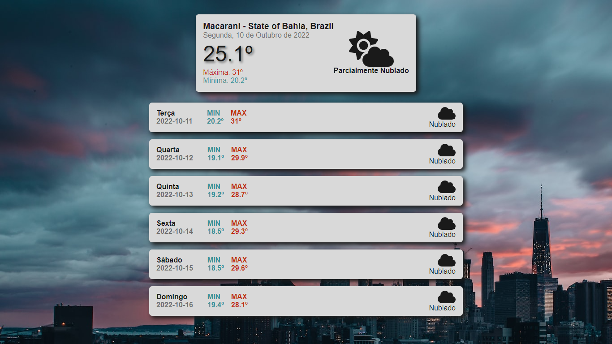
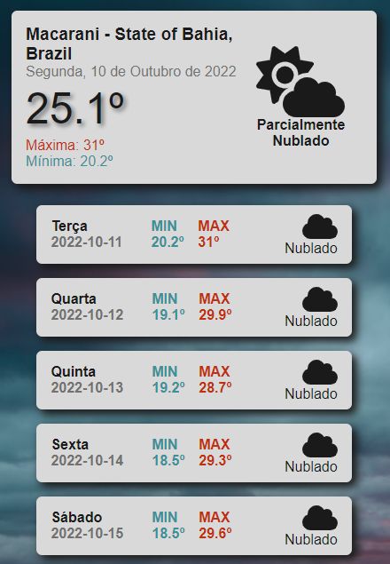

# Weather App 

## Fullscreen 

## Mobile

## Project Description

Gets the current location from the user, and based on that provides the weather for the current day, with max and min temperatures, current day of the month and week, with an icon that changes according to the weather type. Also shows all those features for all days on the current week!

## Technologies Used

- **React.js** as the project framework;
- **Axios** to grab data from the APIs;
- **Navigator GeoLocation** was the method used to acquire the user's current coordinates (LATITUDE) and (LONGITUDE);
- **Google Maps API** parsed the coordinates acquired to give an exact location, with city name, state, and country;
- **Node.JS** for the backend;
- **Express** was the framework used for working with Node;
- **FontAwesome** for the weather icons.

## Challenges Faced

- As it was my first React Project, had to learn all the nuances about the framework, such as how to better manage states and page re-renders
- Setting up a "Loading" state until data is ready was something I never done before, but surely turned out to be a nice feature to implement.
- The API keys couldn't be made public due to security issues, so had to learn how to hide them in a .env variable, and access is using the backend
- It was my first time playing around making my own backend, got a lot of issues learning how to do it, but also learned a lot while solving those problems

## Features To Implement

- Option to click on a specific day and get more weather info about it, like wind speed and air humidity.
- Change background depending on current weather.

